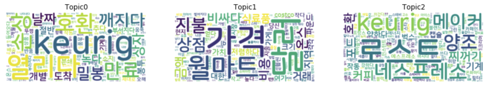

# 토픽 모델링을 사용한 온라인 상품 부정 리뷰 분석
---
## 비즈니스 과제
기업이 온라인에서 상품 및 서비스를 고객에게 판매를 하고, 고객이 상품 리뷰를 남깁니다. 부정적인 리뷰를 분석하여, 어떤 것이 문제이고, 고객이 불만을 가졌는지를 파악하는 것은 기업에게 아주 중요한 문제 입니다. 많은 한글 문장으로 기술된 것에 대해서 부정적인 리뷰를 분석하는 것은 어려운 문제 입니다.
이러한 문제를 해결하기 위해서 다음과 같이 토픽 모델링(Topic Modeling)을 사용할 수 있습니다
- 많은 부정적인 리뷰를 특정 토픽으로 분류를 합니다.
- 각각의 토픽 분류를 위해 영향을 많이 준 "단어"를 추출하여 분석 합니다.
    - 여기서는 영향을 주는 단어들을 워드 클라우드로 가시화하여, 사이즈가 큰 단어가 영향이 크다는 것을 인지할 수 있습니다.
- 각 리뷰에 대해서 특정 토픽 분류될 확율이 높은 것을 추출하여 고객의 붊만을 파악 합니다.
---
# 예시: 아마존 닷컴의 Grocery 부정 리뷰 분석 
## 데이터 요약: 
- 카테고리: Grocery
- 부정 리뷰 : 14,458개
- 토픽수 : 3개

## 토픽 3개에 대한 워드 클라우드 
**글자 크기가 토픽 결정에 영향도를 나타냅니다.**



#### 아래는 위 워드클라우드의 속한 단어를 영향을 많이 주는 순으로 보여 줍니다.
```
Topic 0 - top 10 influential words: 
 {4: 'keurig', 648: '열리다', 977: '호환', 521: '손상', 302: '만료', 145: '깨지다', 366: '밀봉', 164: '날짜', 487: '상자', 189: '녹다'}
Topic 1 - top 10 influential words: 
 {9: '가격', 222: '달러', 691: '월마트', 831: '지불', 488: '상점', 458: '비싸다', 668: '온스', 459: '비용', 128: '금액', 553: '식료품'}
Topic 2 - top 10 influential words: 
 {288: '로스트', 4: 'keurig', 186: '네스프레소', 614: '양조', 330: '메이커', 845: '찌꺼기', 889: '커피', 935: '포드', 977: '호환', 131: '기계'}```
```
## 토픽 정의
#### 토픽0
- 상품 배송 이슈 및 유통 기한의  ("열리다", "깨지다", "녹다", "손상", "밀봉", "만료")

#### 토픽1
- 가격에 대한 내용 ("가격","달러","지불","비싸다","금액")

#### 토픽2
- 커피 및 차에 대한 내용 ("로스트","keurig","네스프레소","찌꺼기","커피")


## 토픽 할당 부정 리뷰 예시
예제로서 실제 토픽에 할당이 된 부정 리뷰를 토픽별로 보여 줍니다.

#### 토픽0
```
(1) 멋진 진저 맥주.지금까지, 내가 제일 좋아하는!나는 매우 적시에 발송물을 받았지만, 모든 외부 캔은 분쇄되어 플라스틱 안에 분사되었습니다.
나는 소다 선적을위한 더 나은 내부 포장을 기대했다.
적어도 소다와 상자 사이의 장벽.내 음료의 절반 이상이 패키지에 쏟아졌다.
(2) 7 월 1 주에 배달 된 제품. 5 월에 만료 된 2015
(3) 밀가루 자체는 매우 좋습니다.내가 좋아하지 않는 것은 “최고”날짜가 3 개월 만에 있다는 것입니다.
3 개월 만에 밀가루 4 봉지.우리 가정에서는 아니야그보다 더 긴 유통 기한이 있어야합니다.
```
#### 토픽1
```
(1) 정품이지만 너무 비쌉니다. $10 미만으로 코스트코 또는 Bj에서 얻을 수 있습니다.
(2) 이것을 위해 많이 보냈다... 일반 상점 구매 “싼”밀가루와이 “프리미엄”밀가루의 차이를 맛볼 수 없다... 아마도이 회사/판매자가 구매자를 사기꾼다.
(3) 나는 이번 여름 초에 많은 기대로이 라이치를 샀다.그러나 라이치스는 평범한 것보다 더 아무것도 없었다 
나는 로컬 일부 상점에서 더 나은 품질의 라이치를 얻을 것을 나중에 깨달았다.
이것에 돈을 낭비하는 데 실망감을 느낍니다.
```
#### 토픽2
```
(1) 그것은 맛이 없었기 때문에 정말 블루베리 녹차를 좋아하지 않았다.나는 그것을 맛을주기 위해 또 다른 차를 추가해야했다.
나는 정말로 그것을 다시 사지 않을 것이다.
(2) 컨테이너는 제품 가격에 비해 매우 작습니다.나는 망고 하나를 시도했고 나는 지금까지 그것을 좋아하지 않는다.
나쁜 뒷맛을 남기는 강한 냄새가 있습니다.나는 그것으로 아이스 티를 만들었고 일주일 넘게 지났고 끝나지 않았습니다: (내 돈 낭비!
(3) 잘 부어지지 않습니다.첫 번째 컵은 잘 갈 수 있지만 곧 쏟아지는 것은 물방울로 느려집니다.
카라 페 디자인은 끔찍합니다.커피를 뜨겁게 유지하는 것은 미덕이지만 카라페는 잘 부어 질 수 있어야합니다.
이것은 다른 사람들이 지적한대로 절대적으로 실패합니다.
```

---
# 노트북 설명
**아래 1.1, 3.1 의 노트북을 실행하면서 설명 및 해석을 보세요.** <br>
컴프리핸드는 한글 지원의 성능이 안좋아서, 옵션으로 진행하셔도 됩니다.

- (Option) 0.0.Prepare_Amazon_Review_Data.ipynb
    - 영어로 된 리뷰를 한국어로 번역
- 1.1.Preprocess_Data.ipynb
    - 영어로 된 리뷰를 전처리 합니다.
- (Option) 2.1.Request_Comprehend_Topic_Modeling.ipynb
    - 컴프리핸드에 토픽 모델링 작업을 요청 합니다.
- (Option) 2.2.Analyse_Comprehend_Topic_Model.ipynb
    - 컴프리핸드의 토픽 모델링 결과를 분석 합니다.
- 3.1.NTM.ipynb
    - 메인 노트북 입니다. 설명을 읽어 보시면서 실행 하세요.


---
# Reference

### SageMaker NTM
- Neural Topic Model (NTM) Algorithm
    - 개발자 공식 가이드
    - https://docs.aws.amazon.com/sagemaker/latest/dg/ntm.html


- Introduction to Basic Functionality of NTM
    - 세이지 메이커 기본 노트북 샘플
    - https://github.com/aws/amazon-sagemaker-examples/blob/master/introduction_to_amazon_algorithms/ntm_synthetic/ntm_synthetic.ipynb


- Introduction to the Amazon SageMaker Neural Topic Model
    - NTM 최초 블로그 (**이 노트북의 내용을 주로 이용 함**)
    - https://aws.amazon.com/ko/blogs/machine-learning/introduction-to-the-amazon-sagemaker-neural-topic-model/
            - 노트북 샘플
            - https://github.com/aws/amazon-sagemaker-examples/blob/master/introduction_to_applying_machine_learning/ntm_20newsgroups_topic_modeling/ntm_20newsgroups_topic_model.ipynb
            
            
- Amazon SageMaker Neural Topic Model now supports auxiliary vocabulary channel, new topic evaluation metrics, and training subsampling
    - 평가 메트릭 설명 및 vocab.txt를 사용하여 훈련
    - https://aws.amazon.com/ko/blogs/machine-learning/amazon-sagemaker-neural-topic-model-now-supports-auxiliary-vocabulary-channel-new-topic-evaluation-metrics-and-training-subsampling/
    - Notebook
        Amazon SageMaker Neural Topic Model now supports auxiliary vocabulary channel, new topic evaluation metrics, and training subsampling
        - https://github.com/aws/amazon-sagemaker-examples/blob/master/scientific_details_of_algorithms/ntm_topic_modeling/ntm_wikitext.ipynb
        
## NTM Algorithm
- AWS Partner Webinar: Neural Topic Modeling on Amazon SageMaker
    - 전반적인 NTM 설명 웹비나
    - https://www.youtube.com/watch?v=eAMjEv7EABM
- Understanding Variational Autoencoders (VAEs)
    - VAE에 대한 블로그
    - https://towardsdatascience.com/understanding-variational-autoencoders-vaes-f70510919f73
- NTM Paper: Coherence-Aware Neural Topic Modeling
    - NTM 페이퍼
    - https://arxiv.org/pdf/1809.02687.pdf

        
        
## 한글 처리
- KoNLPy: Korean NLP in Python
    - 한글 Tokenizer 참조
    - https://konlpy.org/en/latest/
- Word cloud in Python
    - 워드 클라우드 사용법
    - https://lovit.github.io/nlp/2018/04/17/word_cloud/
- 한글 글꼴 다운로드
    - 무로 한글 폰트 다운로드
    - https://hangeul.naver.com/2017/nanum

### Comprehend
- Comprehend: Creating a Topic Modeling Job Using the Console
    - 콘솔로 Topic Modeling Job 만드는 가이드
    - https://docs.aws.amazon.com/comprehend/latest/dg/getting-started-console-topics.html
- Comprehend: Topic Modeling
    - 컴플리핸드 일반적 설명
    - https://docs.aws.amazon.com/comprehend/latest/dg/topic-modeling.html


